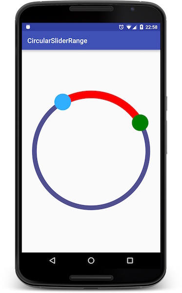

Circular Slider Range
=====================

[  ](https://bintray.com/bozapro/maven/circular-slider-range/_latestVersion)

What is this?
-------------
Circular Slider Range is a small Android library used for slider range. It works similarly to the regular slider control (SeekBar), just goes around in a circular fashion and provider possibility of start and end positions.

**Note**: that the start/stop thumbs scroller (the thing you drag around) can be either a solid-color circle or a custom drawable (like a PNG image).

**Motivation to write this library i got from [CircularSlider](https://github.com/milosmns/circular-slider-android) library, which is used as starting point.**

Requirements
------------
- Android 3.0 or later (Minimum SDK level 11)
- Android Studio (to compile and use)
- **Eclipse is not supported**

Getting Started
---------------
* Add dependency into you `build.gradle`:
 ```compile 'com.bozapro.circular-slider-range:library:1.0.0'```
 
This will run the app on your device. You may need to download a newer version of Gradle, which will be available in the Android Studio UI if compile fails.

What does it look like?
----------------------


Sample usage
------------
    ...
    <com.bozapro.circularsliderrange.CircularSliderRange
        android:id="@+id/circular"
        android:layout_width="match_parent"
        android:layout_height="match_parent"
        android:padding="30dp"
        range:arc_color="@color/colorAccent"
        range:arc_dash_size="20dp"
        range:border_color="#505090"
        range:border_thickness="14dp"
        range:end_angle="30"
        range:end_thumb_image="@drawable/circle_shape"
        range:start_angle="120"
        range:start_thumb_color="#30AEFF"
        range:thumb_size="50dp" />
    ...

Explanation of attributes
-------------------------
Here are some short explanations for the attributes provided by the view. You can leave out any of them, values will get set to default ones.

- `arc_color`: (**refference**) Color of the arc drawn between two thumbs.
- `arc_dash_size`: (**dimension**) Define dash size of the arc drawn between two thumbs.
- `start_angle`: (**float**) The position of the slider start thumb, a degrees based value of the angle (0-360).
- `end_angle`: (**float**) The position of the slider end thumb, a degrees based value of the angle (0-360).
- `border_thickness`: (**dimension**) How thick should the slider border be (this can be a 0-dimension).
- `border_color`: (**color**) Recolors the slider border to the specified color.
- `thumb_size`: (**dimension**) Radius of the slider thumb (thumb is the slider's movable part).
- `start_thumb_image`: (**reference**) Set this to use an image instead of a colored circle for the slider start thumb.
- `end_thumb_image`: (**reference**) Set this to use an image instead of a colored circle for the slider end thumb.
- `start_thumb_color`: (**color**) Set this to use a colored circle instead of an image for the slider start thumb.
- `end_thumb_color`: (**color**) Set this to use a colored circle instead of an image for the slider end thumb.

**Note** that `thumb color` and `thumb image` are mutually exclusive, you can't use both.

Support
-------
If you've found an error while using the library, please [file an issue](https://github.com/bozapro/circular-slider-range/issues/new).
